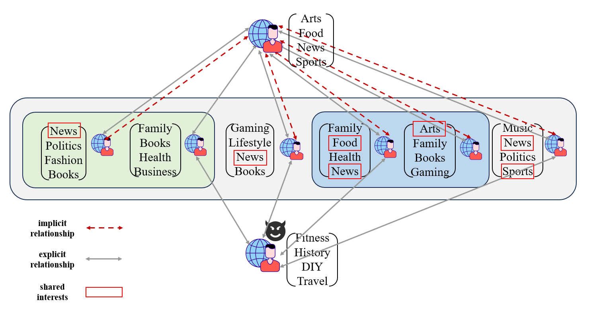

Dear Reviewer ,

Thank you very much for your constructive comments and suggestions on our manuscript titled "BATTLE: Unsupervised Bi-Level Optimization with Implicit Relationship Mining for Attributed Graph Anomaly Detection" with Submission ID 732. We have carefully considered each point and have made significant revisions to address your concerns. Below, we provide a detailed response to your questions.

**Question 1 Respond:**

Thank you very much for your suggestion. We have made the corresponding modifications in the paper.

**Question 2 Respond:** 

Thank you very much for your suggestion. We have made the corresponding modifications in the paper.

**Question 3 Respond:**

Thank you for your suggestion, and we appreciate your understanding regarding the space constraints in the paper. Below is the explanation of how anomalies were injected into the datasets:

As anomalies are rarely directly labeled in real-world datasets, anomaly injection methods are necessary to evaluate the performance of anomaly detection algorithms. In Section 5.1 "Datasets" of the paper, we mentioned using two common anomaly injection methods for the three benchmark datasets (BlogCatalog, Flickr, and Pubmed):

1. **Structural Anomaly Injection**:
   - Structural anomalies refer to abnormalities injected into the network structure, which may involve modifying the connectivity within the network, such as adding or removing edges, to simulate the actions of attackers or malicious actors who create or disrupt connections within the network.

2. **Attribute Anomaly Injection**:
   - Attribute anomalies refer to abnormalities injected into the attributes of network nodes, which may involve altering the attribute values of nodes to simulate data tampering by attackers or inconsistencies caused by system errors.

These injection methods allow us to assess the effectiveness of our BATTLE framework in detecting anomalies under various conditions that mimic real-world scenarios. We hope this explanation provides clarity on our approach to dataset preparation for anomaly detection tasks.

**Question 4 Respond:**

In social networks, explicit relationships typically refer to direct connections or interactions between users, while implicit relationships involve more subtle factors such as shared interests or social circles. Relying solely on explicit relationships for analysis cannot accurately distinguish between normal and anomalous nodes. For example, malicious users may use automated tools to mass-follow others, thereby creating a seemingly normal social circle. In such cases, relying only on explicit relationship analysis would fail to identify the differences in social behavior between malicious and normal users. Furthermore, considering only explicit relationships could lead to the misclassification of normal users as anomalous, especially if they lack significant interactions. Therefore, incorporating implicit relationship analysis becomes crucial. By examining factors such as shared interests and overlapping social circles, we can more accurately identify normal nodes, thereby improving the accuracy of anomaly detection.

**Question 5 Respond:**

Thanks for your question. The primary contribution of BATTLE lies in incorporating implicit relationship into anomaly detection. Regarding the complexity of BATTLE, which comes mainly from the attention network learner, sparsification, graph convolutional network layer, contrastive loss, and implicit relationship prediction. We calculated the complexity of BATTLE as 

$$
O\left(nd(L_1 + b_1) + md_1L + nd_2^1L + nd_2^2L + m^2 + (2 + R)n^2\right)
$$

where \( n(m) \) is the number of nodes(edges), \( b_1 \) is the batch size of attention network. \( d/d_1/d_2 \) are the dimension of node attribute/representation/projection, \( L_1/L \) is the layer number of attention network and GCN, and \( R \) is the number of graph samples. Compared to ANEMONE (with complexity 

$$
O\left(md_1L + nd_2^1L + nd_2^2L + 6n^2\right)
$$

), CoLA (with complexity 

$$
O\left(md_1L + nd_2^1L + nd_2^2L + 4n^2 + c^2nR\right)
$$

), and Sub-CR (with complexity 

$$
O\left(md_1L + nd_2^1L + nd_2^2L + 5n^2 + n^2R\right)
$$

), our method does not have significantly higher complexity (all four methods are in \( O(n^2) \) order of magnitude), yet we achieve notable performance improvement. We will present the computational details of model complexity in the final version. Additionally, we conducted experiments comparing BATTLE with other baselines regarding computational efficiency. As shown in Table 1, the experimental results demonstrate that BATTLE does not significantly increase training time compared to several other methods. However, we achieve notable performance improvement.

**Table 1:** Training time for different methods

| Methods       | BlogCatalog | Flickr    |
| ------------- | ----------- | --------- |
| ANEMONE(2021) | 10.07 min   | 22.40 min |
| CoLA(2022)    | 9.35 min    | 20.60 min |
| Sub-CR(2022)  | 10.90 min   | 23.62 min |
| BATTLE(Ours)  | 11.71 min   | 25.04 min |

We believe that these revisions have significantly improved the quality and clarity of our paper. We are confident that BATTLE provides a valuable contribution to the field and is worthy of presentation at WWW25.

Thank you once again for your thorough review and for giving us the opportunity to improve our work. We look forward to the possibility of presenting our research at WWW25.
